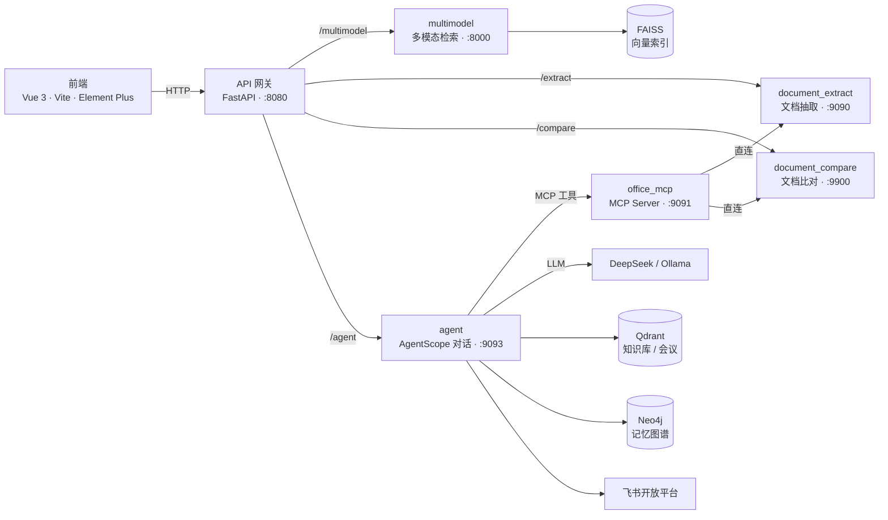

<!-- BEAUTIFIED -->
<h1 align="center">office-agent</h1>

<p align="center">
  <strong>办公智能体平台</strong> —— 多模态检索 · 文档智能处理 · 对话式办公助手
  <br />
  <em>Vue 3 前端 · 六个 FastAPI 后端微服务 · MCP Server · Agent Service，统一经 API 网关单端口对外</em>
</p>

<p align="center">
  <a href="#快速开始"></a>
  <a href="#架构"></a>
  <a href="PROJECT_DOCUMENT.md"></a>
</p>

<p align="center">
  
  
  
  
  
  
  
  
  
  
  
  
</p>

---

## 核心特性

- **多模态检索** — 图像（Chinese-CLIP）、语音（faster-whisper）、文本（SBERT）、人脸（InsightFace）四类相似度检索，基于 FAISS 索引。
- **文档智能处理** — 字段抽取（PaddleOCR PP-StructureV3 + contextgem LLM，输出 Excel）与合同差异比对（RapidOCR + 印章识别）。
- **对话式办公智能体** — AgentScope ReAct 编排，通过 MCP Server 将检索、抽取、比对、知识库、会议能力暴露为工具。
- **飞书会议自动化** — 定时自动接收已结束会议的妙记/智能纪要，委派「会议分析师」子 agent 生成摘要与待办，结合长期记忆画像区分「我的待办」，到期自动提醒。
- **图式长期记忆** — Neo4j 记忆图谱（向量 + 全文 + 图遍历一体），四层溯源 + 萃取/巩固/反思/聚类，可拔插、优雅降级。
- **个人知识库与技能市场** — 本地 Qdrant agentic RAG 知识库；Markdown 指令集技能（SKILL.md）可在内网市场分享安装。

## 架构



后端服务分属三个 conda 环境（`retrieve` / `agent` / `office-agent`），依赖互不兼容，无法合并为同一进程。通过 **API 网关**在 `8080` 端口统一暴露，前端只需访问网关；MCP Server（`9091`）不对外，仅供 Agent Service 内部调用。

## 快速开始

### 环境要求

| 依赖 | 说明 |
| --- | --- |
| Node.js ≥ 18 | 前端构建，推荐 20 LTS |
| Conda | 后端三套互不兼容的依赖环境 |
| Ollama | 本地 LLM 与嵌入（`qwen2.5-1m:14b` 抽取、`qwen3-embedding:8b` 知识库） |
| DeepSeek API Key | Agent Service 默认 LLM 提供商（可切换 OpenAI / DashScope / Ollama） |

### 1. 后端（一键启动，统一端口）

```bash
cp .env.example .env        # 复制模板，填入 DEEPSEEK_API_KEY
cd backend
./start_all.sh              # 启动全部服务，统一对外 http://localhost:8080
```

`start_all.sh` 会依次启动网关与 6 个服务（并 best-effort 拉起记忆图谱所需的 Neo4j / RabbitMQ）：

| 网关路径前缀 | 内部服务 | 内部端口 |
| --- | --- | --- |
| `/multimodel` | multimodel | 8000 |
| `/extract` | document_extract | 9090 |
| `/compare` | document_compare | 9900 |
| `/agent` | agent | 9093 |

停止全部：`./stop_all.sh`（优雅退出，`-f` 强制；按 `Ctrl+C` 亦可）。日志在 `backend/logs/`，各项端口、conda 环境名、LLM 配置均可经环境变量覆盖，详见 `backend/README.md`。

### 2. 前端

```bash
cd frontend
cp .env.example .env        # 默认指向网关 http://localhost:8080
npm install
npm run dev                 # http://localhost:9092
```

生产构建 `npm run build`，预览 `npm run preview`（端口 4173）。

### 3. 记忆图谱基础设施（可选）

记忆图谱默认凭 Neo4j 一项即可运行，其余依赖均可选；未就绪时模块自动降级旁路，不影响对话能力。

```bash
cd backend
./install_memory_infra.sh install && ./install_memory_infra.sh start   # JDK + Neo4j 原生部署
# 高并发/多实例需队列时再启用 Celery（broker=RabbitMQ，result backend=Redis）
./install_rabbitmq.sh install && ./install_rabbitmq.sh start
./run_memory_worker.sh
```

有 Docker 的环境亦可一键起整套基础设施：`docker compose -f docker-compose.memory-graph.yml up -d`（Neo4j / PostgreSQL / Redis）。

## 核心能力

| 模块 | 位置 | 说明 |
| --- | --- | --- |
| 多模态检索 | `backend/multimodel` | 图像 / 语音 / 文本 / 人脸四类检索，模型与 FAISS 索引随项目附带 |
| 文档抽取 | `backend/document_extract` | PDF/Word/Excel/图片 OCR + 大模型字段抽取，输出 Excel；PP-StructureV3 各子模块本地化 |
| 文档比对 | `backend/document_compare` | 合同差异比对，RapidOCR + 印章识别 + 文本对齐 |
| Agent Service | `backend/agent` | AgentScope ReAct 智能对话；上下文压缩 / 卸载；会话持久化 |
| MCP Server | `backend/office_mcp` | 将后端能力暴露为 MCP 工具，供 Agent 调用 |
| 个人知识库 | `agent` 内建 | 本地分块 + Ollama 嵌入 + Qdrant 检索，agentic RAG（`search_knowledge` 工具） |
| 记忆图谱 | `backend/agent/memory_graph` | Neo4j 图式长期记忆，AgentScope 中间件形态，可拔插 |
| Skill 系统 | `agent` 内建 | Markdown 指令集（SKILL.md），内网市场共享 / 安装快照 |
| 飞书会议 | `agent` 内建 | 自动接收 / 子 agent 分析 / 待办提醒 / 独立会议知识库 |

## 飞书会议功能

1. **账号配置（数据隔离）**：每个用户在「飞书会议」页配置自己的飞书自建应用（App ID / App Secret / 本人 Open ID），用户凭证独立且会议按「参会人 = 本人」过滤，双重保证只接收属于自己的会议数据。应用需开通「获取会议信息（含智能纪要/逐字稿）」与「查看云文档」权限。
2. **自动接收**：后台每 5 分钟轮询已结束会议，自动拉取妙记/智能纪要正文；OAuth 回调经网关完成换 token，无需公网。
3. **子 agent 处理**：主 agent 通过 `process_meeting` / `list_my_meetings` 工具把会议委派给「会议分析师」子 agent（Orchestrator-Workers 模式），产出摘要、要点与待办。
4. **我的待办**：子 agent 结合长期记忆用户画像三分类（我的 / 待确认 / 他人）；「待确认」由用户在页面手动确认或拒绝。
5. **定时提醒**：待办截止前 30 分钟自动提醒，应用内通知为默认通道，可在设置中启用邮件（SMTP）与微信（Server酱）推送。
6. **会议知识库**：会议正文写入独立 Qdrant 集合（与个人知识库物理隔离），对话中可经「+」菜单「会议检索」开关控制是否启用。
7. 冒烟测试：`cd backend/agent && python meetings_smoke_test.py`（需 DeepSeek Key；Ollama 嵌入不可用时自动跳过知识库用例）。

## 服务与端口

| 服务 | 目录 | conda 环境 | 端口 | 说明 |
| --- | --- | --- | --- | --- |
| gateway | `backend/gateway` | `retrieve` | 8080 | 统一入口（对外） |
| multimodel | `backend/multimodel` | `retrieve` | 8000 | 图像/语音/文本/人脸检索 + FAISS |
| document_extract | `backend/document_extract` | `agent` | 9090 | PaddleOCR + contextgem(LLM) 抽取 |
| document_compare | `backend/document_compare` | `agent` | 9900 | RapidOCR + 印章识别 比对 |
| office_mcp | `backend/office_mcp` | `office-agent` | 9091 | MCP Server（仅内部） |
| agent | `backend/agent` | `office-agent` | 9093 | AgentScope ReAct 对话服务 |
| frontend | `frontend` | — | 9092 | Vue3 前端（dev） |

## 目录结构

```
office-agent/
├── backend/
│   ├── multimodel/          # 多模态检索服务（CLIP/Whisper/SBERT/InsightFace/FAISS）
│   ├── document_extract/    # 文档字段抽取服务（OCR + LLM）
│   ├── document_compare/    # 文档比对服务（合同差异比对）
│   ├── office_mcp/          # MCP Server（后端能力暴露为 MCP 工具）
│   ├── agent/               # Agent Service（AgentScope ReAct 对话）
│   │   └── memory_graph/    # 图式长期记忆模块（Neo4j，可拔插）
│   ├── gateway/             # API 网关（单端口反向代理）
│   ├── start_all.sh         # 一键启动全部后端服务
│   ├── stop_all.sh          # 一键停止
│   └── install_memory_infra.sh / install_rabbitmq.sh  # 记忆图谱基础设施脚本
├── frontend/                # Vue3 + Vite 5 + Element Plus 前端
└── docker-compose.memory-graph.yml   # 记忆图谱基础设施（Neo4j/PG/Redis，可选）
```

## 技术栈

| 层级 | 技术 |
| --- | --- |
| 前端 | Vue 3.2 · Vite 5 · Element Plus · Pinia · vue-router · marked · force-graph |
| Python 框架 | FastAPI · Uvicorn · AgentScope ≥2.0 · MCP ≥1.0 |
| 大模型 | DeepSeek（默认）· OpenAI · DashScope · Ollama（本地抽取/嵌入） |
| 检索 / 视觉 | Chinese-CLIP · sentence-transformers · faster-whisper · InsightFace · FAISS |
| OCR | PaddleOCR PP-StructureV3 · RapidOCR · contextgem |
| 向量 / 图谱 | Qdrant（知识库/会议）· Neo4j（记忆图谱，图+向量+全文） |
| 基础设施 | RabbitMQ / Celery（可选队列）· Redis（可选计数）· PostgreSQL（可选审计库） |
| 消息 / 通知 | SSE 推送 · SMTP 邮件 · Server酱 微信 |

## 模型与数据资产

为使项目开箱即用，运行所需的模型权重与样例数据已随项目一并放入：

- `backend/multimodel/models/`：Chinese-CLIP `ViT-B-16`、InsightFace `buffalo_l`
- `backend/multimodel/repositories/`：样例图像 / 音频 / 转写文本 / 缩略图
- `backend/multimodel/indices/`：已构建的 FAISS 索引及 meta
- `backend/document_extract/pretrained_models/`：PaddleOCR PPStructureV3 各子模块 + sat 段落切分模型
- `backend/document_extract/data/`、`backend/document_compare/data/`：样例 PDF

## 环境变量配置

项目通过 `.env` 管理 API Key 等敏感信息，`start_all.sh` 启动时自动加载项目根目录的 `.env`。

```bash
cp .env.example .env        # 复制模板
# 编辑 .env，填入 API Key 等信息
./backend/start_all.sh      # 自动加载 .env
```

> `.env` 已在 `.gitignore` 中忽略。模板见 [`.env.example`](.env.example)。

| 环境变量 | 说明 | 默认值 |
| --- | --- | --- |
| `DEEPSEEK_API_KEY` | DeepSeek API 密钥（默认提供商） | 空（必须设置） |
| `OPENAI_API_KEY` / `DASHSCOPE_API_KEY` | OpenAI / DashScope API 密钥 | 空 |
| `LLM_PROVIDER` | Agent Service 模型提供商 | `deepseek`（deepseek/openai/dashscope/ollama） |
| `DOC_EXTRACT_SECRET_KEY` | JWT 签名密钥（Agent 与 document_extract 共享） | `document-extract-key` |
| `SERVICE_ACCOUNT_PASSWORD` | document_extract 服务账号密码 | `123456` |
| `MEETING_SYNC_INTERVAL` | 飞书会议同步轮询间隔（秒） | `300` |
| `MEETING_SYNC_LOOKBACK_DAYS` | 会议同步回看窗口（天，≤90） | `3` |
| `MEETING_REMIND_LEAD_MINUTES` | 会议待办提前提醒（分钟） | `30` |
| `SMTP_HOST/PORT/USER/PASSWORD/FROM` | 邮件通知 SMTP（可选，用户在页面启用） | 空 |
| `MEMORY_GRAPH_*` | 记忆图谱（Neo4j 连接 / 审计库 / Redis / Celery / 嵌入维度等） | 见 `.env.example` |

## 备注

- 各服务的 `users.db`（含初始 admin 账号）位于 `backend/document_extract/users.db`，迁移/重置时请保留或重新初始化。
- MCP Server 直连内部服务（不走网关），避免循环依赖；需配置 `SERVICE_ACCOUNT_PASSWORD` 服务账号密码。
- 记忆图谱模块默认零额外配置即可运行（审计库 SQLite、进程内异步萃取）；Neo4j 不可达时整体旁路，对话不受影响。
- 单独调试某服务：在对应目录用 `uvicorn main:app --port <port>` 启动（MCP Server 用 `python server.py`），详见各服务 `README.md`。

---

> No LICENSE file detected. Add a LICENSE to clarify project licensing.